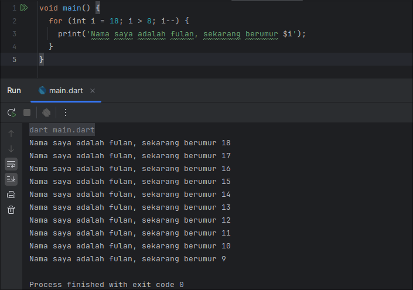

# Tugas Praktikum

## Soal 1
Modifikasilah kode pada baris 3 di VS Code atau Editor Code Favorit Anda berikut ini agar mendapatkan keluaran (output) sesuai yang diminta
> Jawab : 
*Code and Hasil running* 

## Soal 2
Mengapa sangat penting untuk memahami bahasa pemograman Dart sebelum kita menggunakan framework Flutter? Jelaskan!
> Jawab : \
Berikut adalah alasan-alasan mengapa pemahaman yang mendalam tentang Dart menjadi krusial sebelum memulai dengan Flutter:
>1. Fondasi Dasar untuk Flutter
   >   - Flutter dibangun di atas Dart, sehingga semua kode Flutter ditulis dalam bahasa ini. Jika Anda memahami Dart, Anda dapat lebih mudah memahami cara Flutter bekerja, bagaimana komponennya berinteraksi, dan bagaimana aplikasi dikompilasi dan dijalankan.
   >   - Widget: Di Flutter, segala sesuatu adalah widget, dan untuk membuat serta memodifikasi widget, Anda harus memahami konsep-konsep dasar Dart seperti fungsi, kelas, dan pola OOP (Object-Oriented Programming). 
   >   - State Management: Pemahaman tentang manajemen status dalam Flutter, seperti StatefulWidget dan StatelessWidget, juga bergantung pada pemahaman Anda terhadap cara kerja kelas dan objek di Dart.
>2. Fleksibilitas dalam Pembuatan Aplikasi
   Dengan pemahaman yang kuat tentang Dart, Anda akan lebih fleksibel dalam membuat berbagai fitur aplikasi Flutter. Dart memiliki fitur-fitur seperti:
   >   - Asynchronous Programming (async/await): Ini penting karena Flutter sering melakukan tugas-tugas asynchronous, seperti pengambilan data dari internet, interaksi dengan basis data, atau operasi IO lainnya.
   >   - Future dan Stream: Dart menyediakan cara-cara untuk menangani data yang datang secara bertahap, yang sering digunakan dalam pengembangan aplikasi real-time dengan Flutter.
   >   - Null Safety: Dart mendukung fitur Null Safety, yang membantu mencegah error akibat referensi null. Flutter secara ketat memanfaatkan fitur ini untuk memastikan stabilitas aplikasi.

## Soal 3
Rangkumlah materi dari codelab ini menjadi poin-poin penting yang dapat Anda gunakan untuk membantu proses pengembangan aplikasi mobile menggunakan framework Flutter.
> Jawab : \
*Getting Started with Dart* \
Tujuan Dart adalah menggabungkan kelebihan dari sebagian besar bahasa tingkat tinggi dengan fitur-fitur Bahasa pemograman terkini, yaitu :
>- Productive Tooling : Dart menyediakan alat-alat produktif seperti analisis kode, plugin IDE, dan ekosistem paket yang besar.
>- Garbage Collection : Dart menangani dealokasi memori secara otomatis, terutama untuk objek yang tidak lagi digunakan.
>- Type Annotations (Opsional) : Dart menyediakan keamanan dan konsistensi dalam mengelola data, meskipun hal ini opsional.
>- Statically Typed : Dart menggunakan type-safe dan type inference untuk menemukan bug saat kompilasi, meskipun tipe data bersifat opsional
>- Portability : Dart dapat dikompilasi ke JS untuk web dan kode native untuk ARM dan x86
>- Relevansi Dart dengan Flutter : Pengembangan flutter sendiri sepenuhnya menggunakan dart, sehingga pemahaman tentang dart akan membuat pengembangan flutter lebih nyaman dan produktif.

>*The evolution of Dart*
>- Diluncurkan pada 2011 : Versi stabil dirilis pada tahun 2013, dengan perubahan besar pada dart 2.0 di akhir tahun 2018.
>- Peralihan fokus : Awalnya Dart untuk pengembangan web sebagai ganti JS, kini fokus pada pengembangan mobile, termasuk flutter
>- Memecahkan masalah JavaScript : Dart dirancang untuk memberikan ketangguhan yang tidak dimiliki JS, menjadi alternatif yang lebih baik
>- Performa dan Alat Modern : Dart menawarkan performa terbaik dan alat modern untuk berskala besar dengan plugin IDE yang stabil
>- Kuat dan Fleksibel : Menggabungkan type annotations opsional dan fitur OOP untuk keseimbangan fleksibilitas dan ketangguhan
>- Bahasa Modern dan Lintas Perform : Dart meningkatkan fitur-fiturnya untuk mendukung pengembangan lintas platform dengan fleksibilitas tinggi, membuatnya menjadi pilihan yang ideal untuk Flutter

>*How Dart Works*
>- Eksekusi kode dart : Dilakukan melalui dua cara, Dart Virtual Machines (VMs) dan JS compilations
>- Dua Mode Kompilasi Dart :
   \
   Kompilasi JIT (Just-In-Time) : Kode sumber dikompilasi sesuai kebutuhan, digunakan untuk pengembangan aplikasi dengan fitur seperti debugging dan hot reload\
   Kompilasi AOT (Ahead-Of-Time) : Kode dikompilasi sebelumnya, memberikan performa tinggi namun tanpa fitur debugging dan hot reload.
   > Lingkungan Dart : Eksekusi kode dart membutuhkan runtime systems, Dart core libraries, dan garbage collectors
>- Hot Reload : Fitur terkenal flutter yang memungkinkan perubahan kode diterapkan dengan cepat, berbasis compiler Dart JTI, mendukung pengembangan perangkat lunak yang cepat dan berkualitas tinggi
>- Pentingnya memahami dasar dart : Memahami konsep dasar Dart sebelum menggunakannya.# Tugas Praktikum