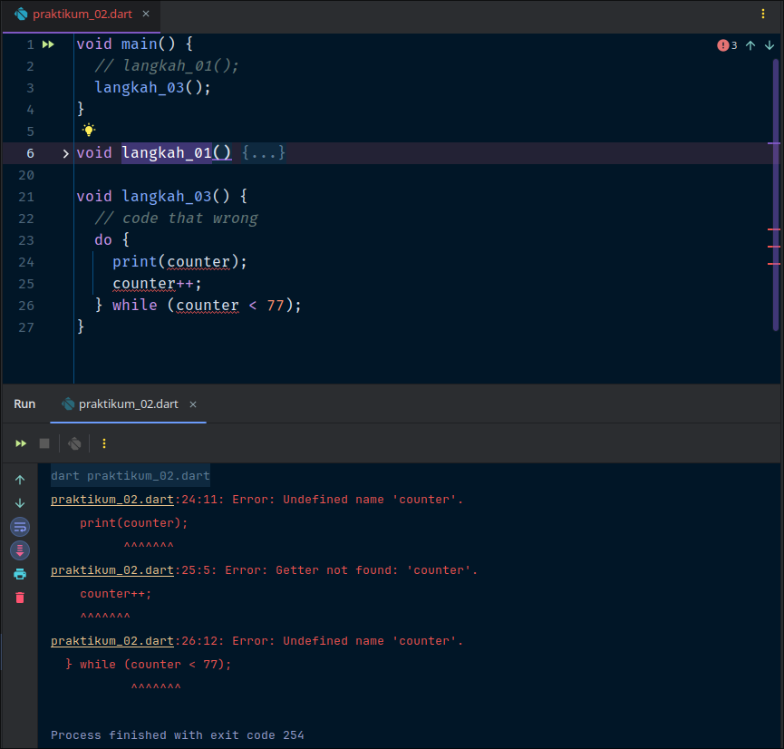
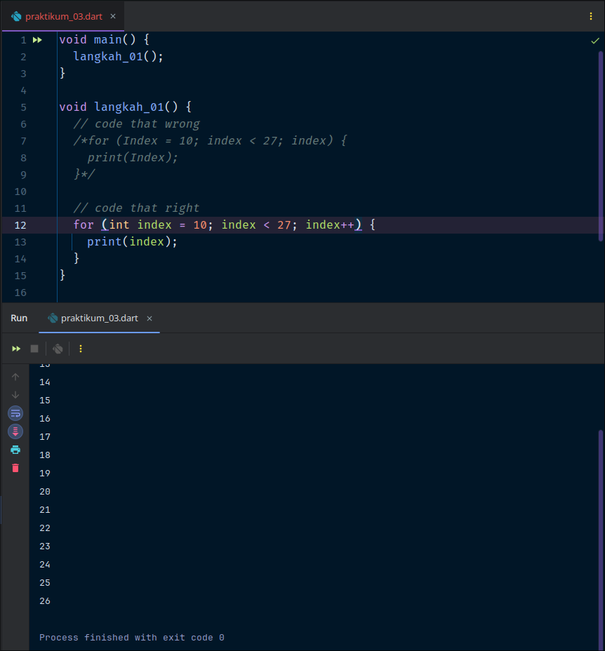

NIM : 2241720133 \
NAMA : Muhammad Khairunnas Nurdin

# Praktikum 1 : Menerapkan Control Flows ("if/else")
Selesaikan langkah-langkah praktikum berikut ini menggunakan DartPad di browser anda

### Langkah 1
Ketik atau salin kode program berikut ke dalam fungsi main().

### Langkah 2
Silakan coba eksekusi(Run) kode pada langkah 1 tersebut. Apa yang terjadi? Jelaskan!
>Jawab : \
Yang terjadi adalah error, karena penulisan kode pada 'else If' salah dan begitu juga pada kode 'Else' yang seharusnya benar adalah 'else if' dan 'else' lebih tepatnya tidak ada huruf kapital.
Dibawah ini versi benarnya : \

Maksud dari kode diatas adalah melakulan pengecekan kondisi terhadap nilai variabel test. \
Penjelasan singkatnya :
>1. Variabel **test** diinisalisasi dengan nilai **"test2"**
>2. if-else statement pertama :
>- Jika test bernilai "test1", maka akan mencetak "Test1".
>- Jika test bernilai "test2", maka akan mencetak "Test2". (Kondisi ini yang terpenuhi).
>- Jika nilainya berbeda, maka akan mencetak "Something else".
>3. if statement kedua :
>- Jika test bernilai "test2" (yang benar), maka akan mencetak "Test2 again".

### Langkah 3
Tambahkan kode program berikut, lalu coba eksekusi (Run) kode anda.\
Apa yang terjadi? Jika terjadi error, silahkan perbaiki namun tetap menggunakan if/else.\
Jawab :
>\
Yang terjadi adalah error. Karena variabel test bertipe string sedangkan pada kondisi if, harus menggunakan nilai boolean (true atau false).

>Versi benarnya sebagai berikut :\

# Praktikum 2: Menerapkan Perulangan "while" dan "do-while"

Selesaikan langkah-langkah praktikum berikut ini menggunakan Dartpad pada browser Anda.

### Langkah 1
Ketik atau salin kode program berikut ke dalam fungsi main().

### Langkah 2
Silakan coba eksekusi (Run) kode pada langkah 1 tersebut. Apa yang terjadi? Jelaskan! Lalu perbaiki jika terjadi error. \
Jawab :
> Yang terjadi adalah error karena variabel counter belum dideklarasikan dan harus menginisialisasinya dengan nilai awal.\
Perbaikan kode dibawah ini :

### Langkah 3
Tambahkan kode program berikut, lalu coba eksekusi (Run) kode Anda.

\
Apa yang terjadi? Jika terjadi error, silakan perbaiki namun tetap menggunakan *do-while*. \
Jawab :
>Yang terjadi adalah loop do-while kedua akan mencetak nilai counter dari 33 hingga 76.

# Praktikum 3 : Menerapkan Perulangan "for" dan "break-continue"
Selesaikan langkah-langkah praktikum berikut ini menggunakan DarPad di browser Anda.

### Langkah 1
Ketik atau salin kode program berikut ke dalam fungsi main().

### Langkah 2
Silakan coba eksekusi (Run) kode pada langkah 1 tersebut. Apa yang terjadi? Jelaskan! Lalu perbaiki jika terjadi error.\
Jawab :
> Yang terjadi adalah error, karena variabel index tidak dideklarasikan, selain itu penamaan variabel pada di Dart umumnya menggunakan huruf kecil di awal, jadi sebaiknya di tulis "index". Pada bagian for yaitu bagian increment (index++) tidak ada ekspresi yang menambah nilai index, sehingga loop akan berjalan tanpa batas karena index tidak pernah berubah.

>Perbaikan pada kode :\

### Langkah 3
Tambahkan kode program berikut di dalam *for-loop*, lalu coba eksekusi (Run) kode Anda.

\
Apa yang terjadi ? Jika terjadi error, silakan perbaiki namun tetap menggunakan for dan break-continue. \
Jawab :
> Yang terjadi adalah error, karena penulisan variabel pada "if" dan "else if" umumnya menggunakan huruf kecil di awal. Dalam kode diatas break dan continue digunakan tanpa blok {}, sehingga ini bisa menyebabkan masalah.

> Perbaikan kode yang benar :\

> Loop akan tidak mencetak nilai apapun index dari 10 hingga 20, lalu berhenti karena break dieksekusi ketika index bernilai.

# Tugas Praktikum
2. Buatlah sebuah program yang dapat menampilkan bilangan prima dari angka 0 sampai 201 menggunakan Dart. Ketika bilangan prima ditemukan, maka tampilkan nama lengkap dan NIM Anda. \
   Jawab :
> Source Code and output :\
