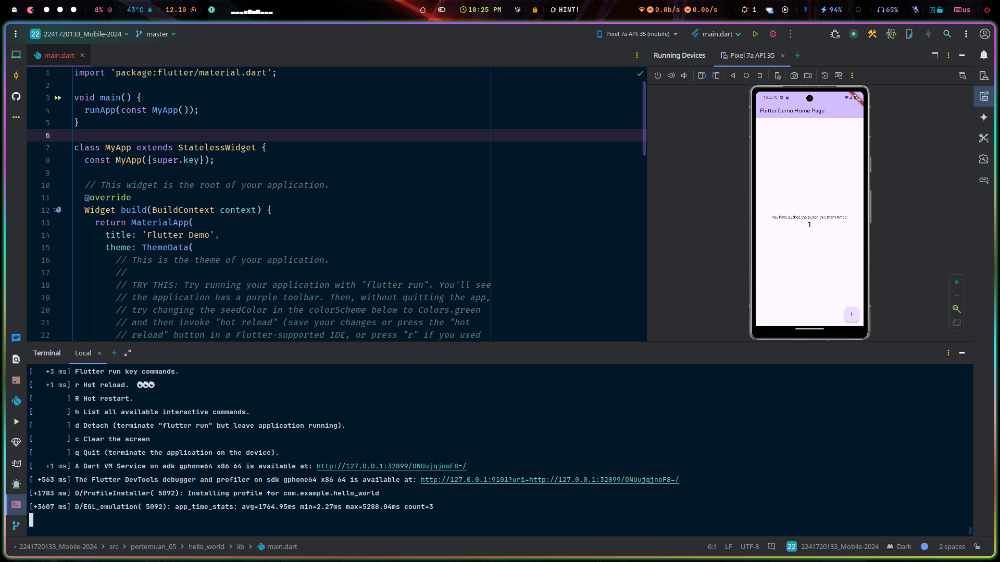
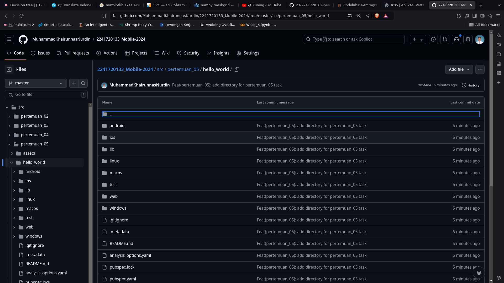
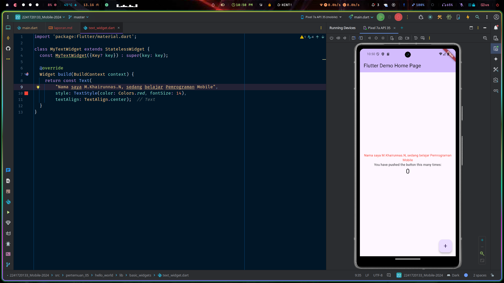
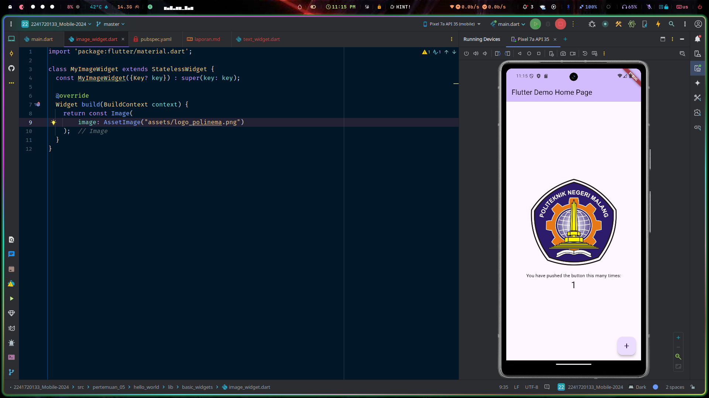
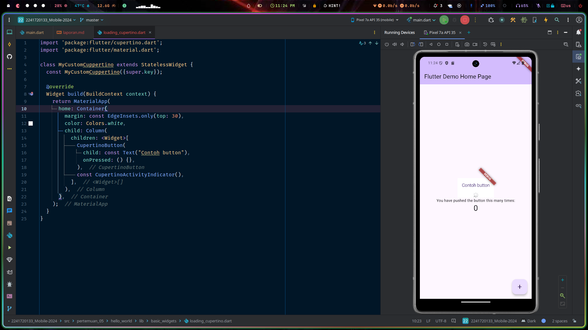
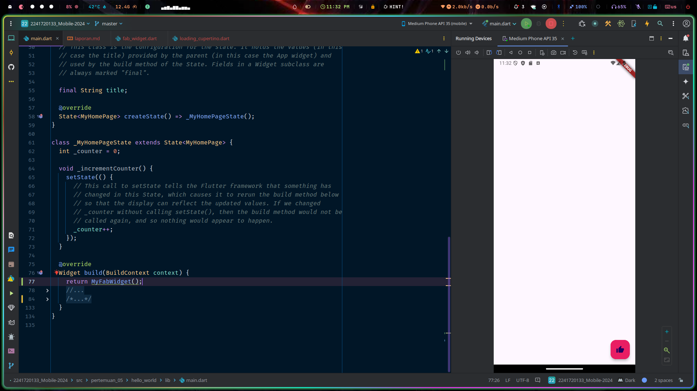
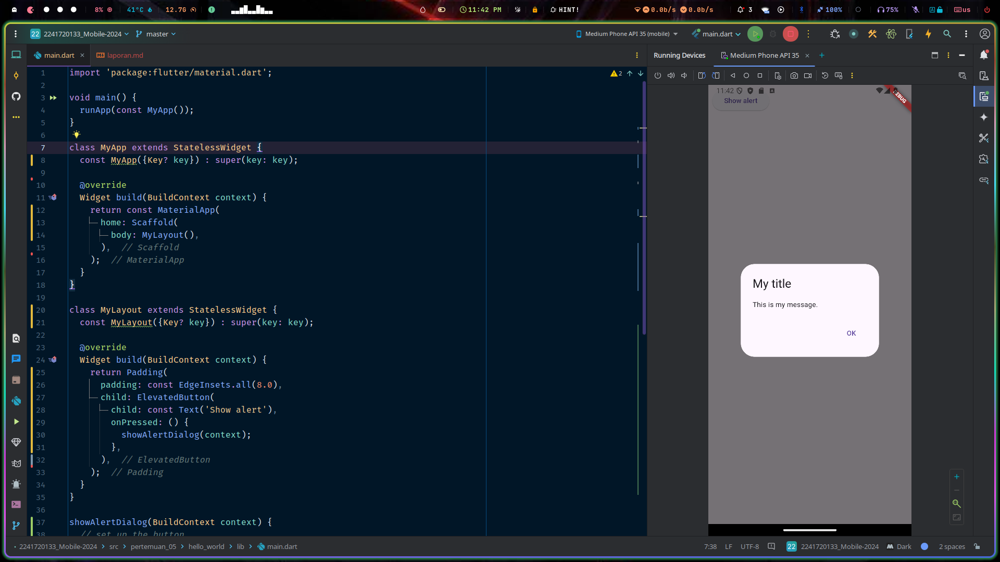
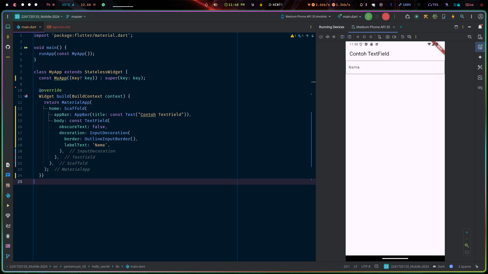
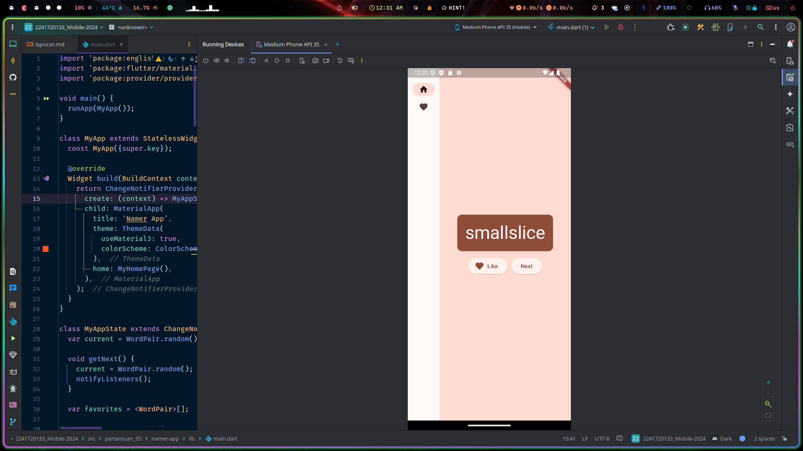
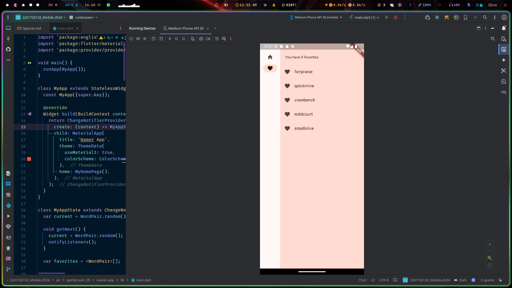

# Praktikum 1: Membuat Project Flutter Baru

**Langkah 1:**

Membuat project baru dengan nama `hello_world`.

Hasil:

# Praktikum 2: Menghubungkan Perangkat Android atau Emulator

# Praktikum 3: Membuat Repository GitHub dan Laporan Praktikum

# Praktikum 4: Menerapkan Widget Dasar

**Langkah 1: Text Widget**

Lakukan import file text_widget.dart ke main.dart, lalu ganti bagian text widget dengan kode di atas. Maka hasilnya seperti gambar berikut. Screenshot hasil milik Anda, lalu dibuat laporan pada file README.md.

**Langkah 2: Image Widget**

Buat sebuah file image_widget.dart di dalam folder basic_widgets dengan isi kode berikut.

# Praktikum 5: Menerapkan Widget Material Design dan iOS Cupertino

**Langkah 1: Cupertino Button dan Loading Bar**

**Langkah 2: Floating Action Button (FAB)**

**Langkah 3: Scaffold Widget**

**Langkah 4: Dialog Widget**

**Langkah 5: Input dan Selection Widget**

**Langkah 6: Date and Time Pickers**

# Tugas praktikum

**Bukti Screecshot**

**Bukti Gif**

