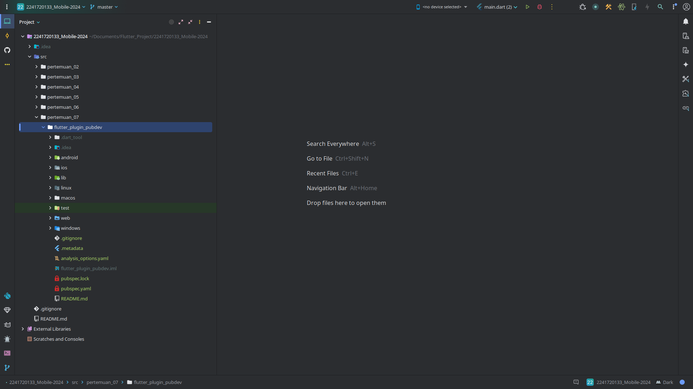
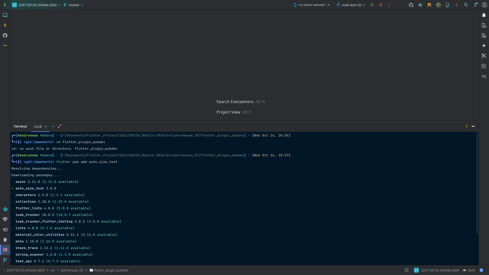
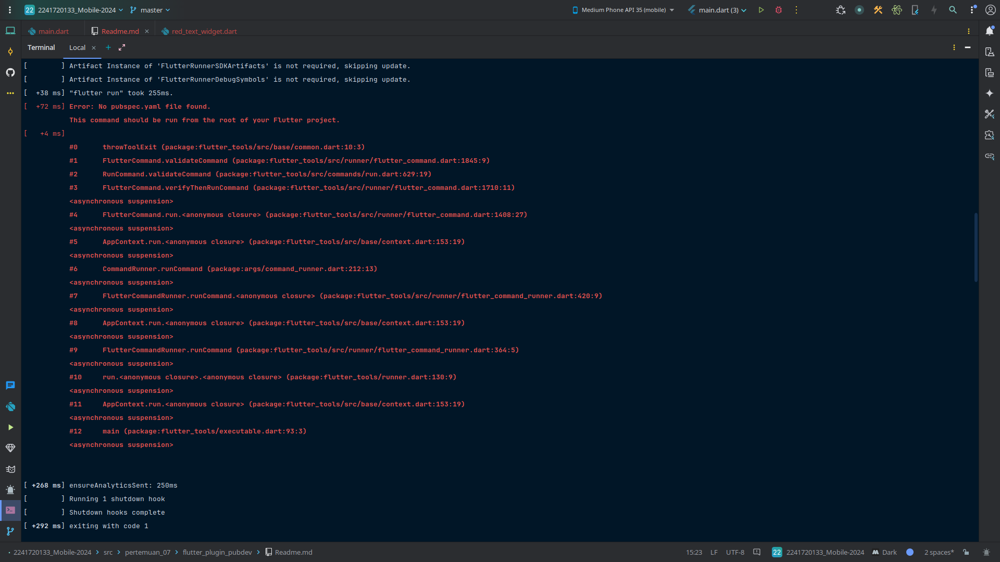

# Langkah 1: Buat Project Baru
Output:

# Langkah 2: Menambahkan Plugin
Output:

# Langkah 3: Buat file red_text_widget.dart
Output:

tidak bisa run karna:

# Langkah 4: Tambah Widget AutoSizeText
Output:

tidak bisa run karna:

# Langkah 5: Buat Variabel text dan parameter di constructor
Output:

tidak bisa run karna:

# Langkah 6: Tambahkan widget di main.dart
Output:

tidak bisa run karna:

# TUGAS PRAKTIKUM

## 1. Selesaikan Praktikum tersebut, lalu dokumentasikan dan push ke repository Anda berupa screenshot hasil pekerjaan beserta penjelasannya di file README.md!

## 2. Jelaskan maksud dari langkah 2 pada praktikum tersebut!
### Jawaban:
karena variabel text belum didefinisikan di dalam RedTextWidget.

## 3. Jelaskan maksud dari langkah 5 pada praktikum tersebut!
### Jawaban:
Langkah ini merupakan cara untuk mendeklarasikan dan menginisialisasi properti di dalam kelas RedTextWidget, terutama properti text, yang akan digunakan di dalam widget ini.

## 4. Pada langkah 6 terdapat dua widget yang ditambahkan, jelaskan fungsi dan perbedaannya!

### Jawaban:

- **Widget pertama**

  **Fungsi:**
    - Container ini memberikan warna latar belakang kuning muda (`yellowAccent`).
    - Lebar Container ini dibatasi menjadi 50.
    - Teks ditampilkan dengan menggunakan `RedTextWidget`, widget custom yang telah kamu buat.

  **RedTextWidget:**
    - `RedTextWidget` adalah widget yang menggunakan `AutoSizeText`, yang secara otomatis akan menyesuaikan ukuran teks agar pas di dalam kontainer dengan batas tertentu (seperti `maxLines` yang telah diatur ke 2).
    - Teks ini ditampilkan dalam warna merah dan ukuran font 14. Selain itu, jika teks terlalu panjang, akan dipotong menggunakan elipsis (`...`).

- **Widget kedua**

  **Fungsi:**
    - Container ini memberikan warna latar belakang hijau muda (`greenAccent`).
    - Lebar Container ini dibatasi menjadi 100.
    - Teks ditampilkan menggunakan widget default Flutter, yaitu `Text`.

  **Text Widget:**
    - Widget `Text` menampilkan teks apa adanya tanpa adanya fitur tambahan seperti auto-sizing, batas baris, atau elipsis (kecuali kamu mengatur properti seperti `overflow` atau `maxLines`).
    - Tidak ada warna atau ukuran font yang diatur di sini, jadi akan menggunakan gaya teks default dari Flutter (biasanya berwarna hitam dan ukuran font default dari tema aplikasi).

## 5. Jelaskan maksud dari tiap parameter yang ada di dalam plugin auto_size_text berdasarkan tautan pada dokumentasi ini !
### Jawaban:
- text: Ini adalah parameter yang mewakili teks yang akan ditampilkan.
- style: Mengatur gaya tampilan teks, termasuk warna dan ukuran font.
- maxLines: Mengatur jumlah maksimal baris yang diizinkan untuk teks. Jika teks melebihi batas jumlah baris ini, maka akan dipotong.
- overflow: Mengatur bagaimana teks yang melebihi batas area yang tersedia akan ditangani.

## 6. Kumpulkan laporan praktikum Anda berupa link repository GitHub kepada dosen!